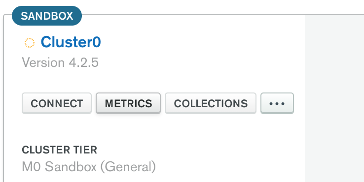
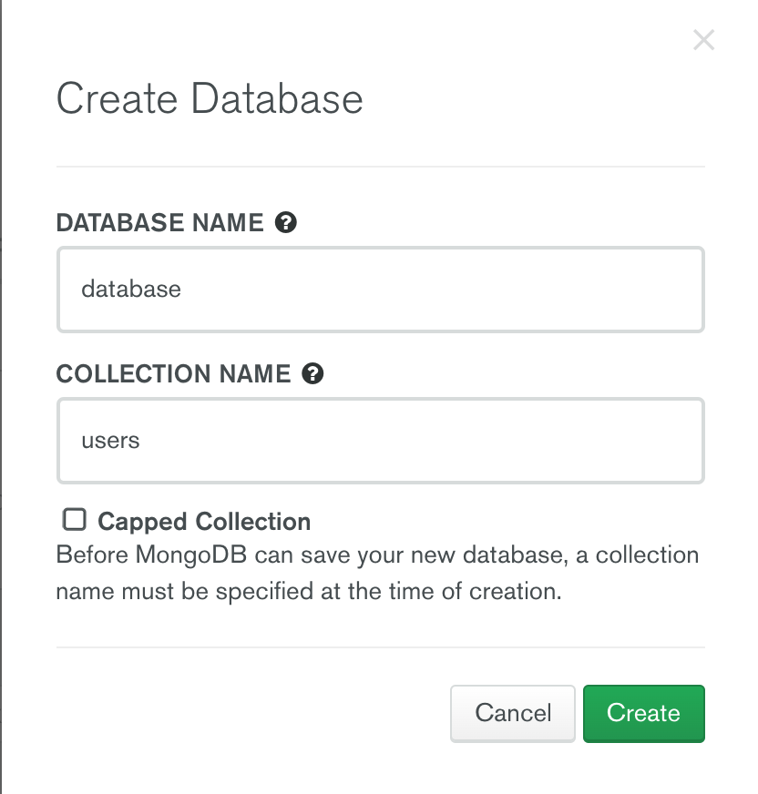
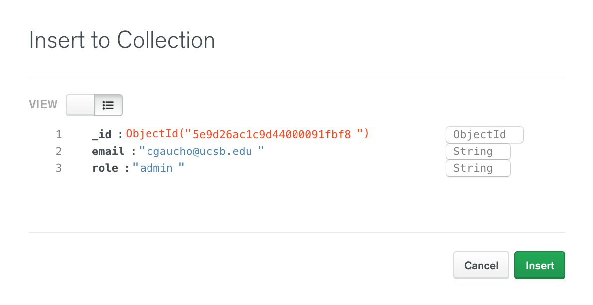

# Setting up MongoDB

Once you have set up your cluster, you need to set up the database and collections that the app will use, as well as
add yourself as an admin user.

1. Click on the "Collections" button on your Atlas dashboard to view your cluster's connections.

   

2. Click "+ Create Database" to create a database. Make sure you name it "database" and create a collection called "users".

   

3. Click "Insert Document" to insert a document into the "users" collection.
   You will be shown a modal with a JSON-like editor.
   You will need to specify two fields, one with a key called "email" and a value matching your email address,
   and one with a key called "role" with the value "admin".

   
