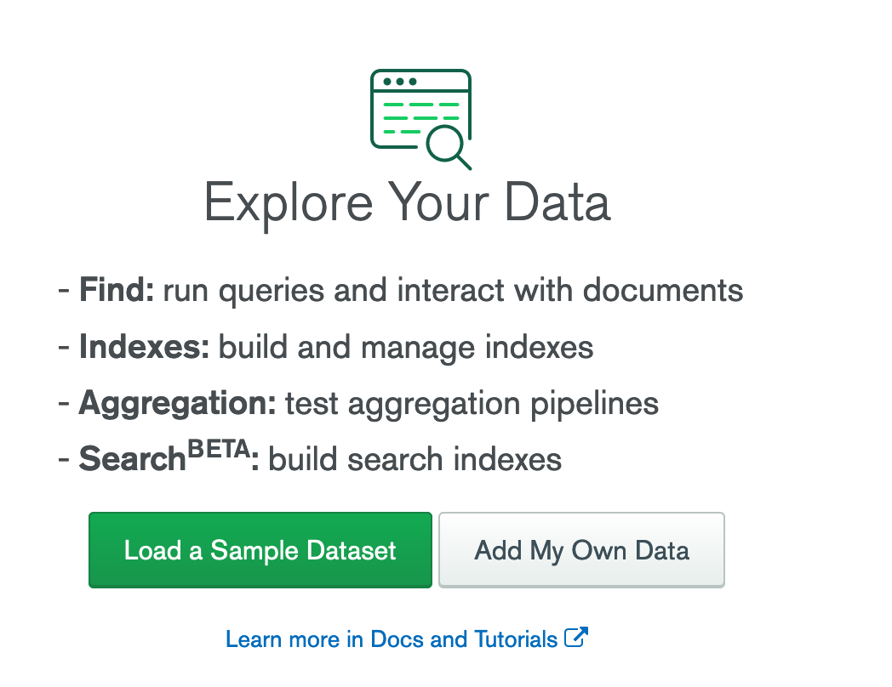

# Setting up MongoDB

Once you have set up your cluster, you need to set up the database and collections that the app will use, as well as
add yourself as an admin user.

1. Click on the "Collections" button on your Atlas dashboard to view your cluster's connections.

   

2. If you see "+ Create Database", click that to create a database.

   If instead, you see
   the following, click the "Add your own Data" button.

   

3. You should now see the "Create Database" dialog as shown below. Give your database the name
   `database` (literally) and create a collection called `users`. It is important to use
   these exact names; they are referenced in the source code.

   

4. Click "Insert Document" to insert a document into the "users" collection.
   You will be shown a modal with a JSON-like editor.
   You will need to specify two fields, one with a key called "email" and a value matching your email address,
   and one with a key called "role" with the value "admin".

   
